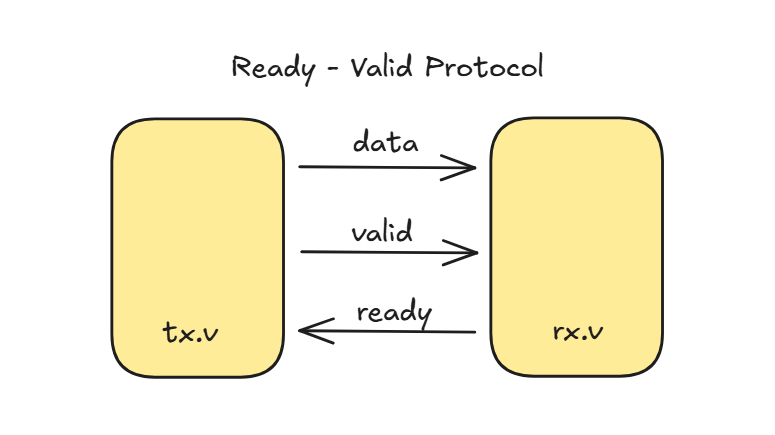
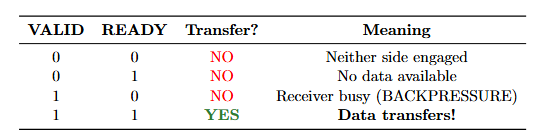
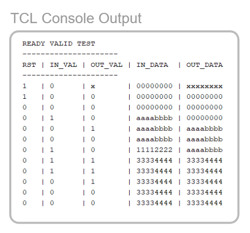
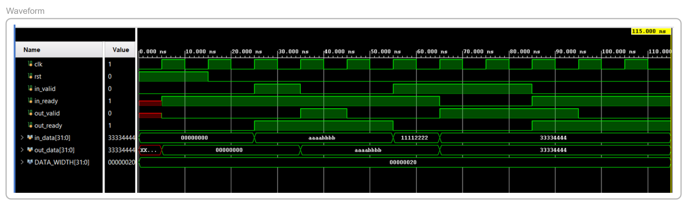

# Pipeline Register with Ready-Valid Handshake Protocol

A synthesizable SystemVerilog implementation of a single-stage pipeline register using the industry-standard **Ready-Valid** handshake protocol for robust data transfer with backpressure support.

## 📋 Overview

This project implements a parameterized pipeline register that enables safe data transfer between two modules using a **valid-ready handshake mechanism**. The design ensures:
- **No data loss** during backpressure conditions
- **No data duplication** 
- **Clean handshake** semantics
- **Synthesizable** and FPGA-friendly design

---

## 🔄 Ready-Valid Protocol

The **Ready-Valid** protocol is a widely-used handshake mechanism in digital design for transferring data between producer and consumer modules.

### Protocol Diagram



### How It Works

The protocol uses three signals:
- **`valid`**: Asserted by the sender (tx.v) when data is available
- **`ready`**: Asserted by the receiver (rx.v) when it can accept data
- **`data`**: The actual data payload

### Transfer Cases



| VALID | READY | Transfer? | Meaning |
|-------|-------|-----------|---------|
| 0 | 0 | ❌ NO | Neither side engaged |
| 0 | 1 | ❌ NO | No data available |
| 1 | 0 | ❌ NO | **Receiver busy (BACKPRESSURE)** |
| 1 | 1 | ✅ YES | **Data transfers!** |

**Key Rule**: A valid data transfer happens **only when both `valid` AND `ready` are HIGH** at the same clock edge.

---

## 🏗️ Module Architecture

### Ports

```systemverilog
module pipeline_register #(
    parameter int DATA_WIDTH = 32
) (
    input  logic                    clk,
    input  logic                    rst,
    
    // Input interface
    input  logic                    in_valid,
    output logic                    in_ready,
    input  logic [DATA_WIDTH-1:0]   in_data,
    
    // Output interface
    output logic                    out_valid,
    input  logic                    out_ready,
    output logic [DATA_WIDTH-1:0]   out_data
);
```

### Key Features

- **Parameterized data width**: Configurable via `DATA_WIDTH` parameter (default: 32 bits)
- **Backpressure handling**: Register can hold data when downstream is not ready
- **Zero bubble cycles**: Efficient throughput with proper handshake
- **Formal verification hooks**: Includes SVA assertions for correctness checking

### Internal Logic

```systemverilog
// Ready when empty OR output is being consumed
assign in_ready = !valid_reg || output_fire;

// Fire conditions
assign input_fire  = in_valid && in_ready;
assign output_fire = out_valid && out_ready;
```

---

## 🧪 Simulation Results

### Console Output

The testbench exercises various scenarios including **reset**, **simple transfers**, **backpressure**, and **recovery**.



**Test Sequence:**
1. **Reset phase** (cycles 1-2): System initializes
2. **Simple transfer** (cycles 3-4): Data `0xaaaabbbb` flows through
3. **Backpressure** (cycles 5-7): Data `0x11112222` loads but output blocked
4. **Backpressure release** (cycles 8-9): Data `0x33334444` transfers

### Waveform Analysis



**Key Observations:**
- **in_ready** goes LOW during backpressure (when `valid_reg` is full and output not consumed)
- **out_data** holds stable value (`0xaaaabbbb`) when `out_ready` is LOW (backpressure)
- Data integrity maintained: `0x11112222` → `0x33334444` sequence preserved
- Clean handshake transitions with no data loss

---

## 🚀 Usage

### Compilation

```bash
iverilog -g2012 -o sim rtl/pipeline_reg.sv rtl/tb_pipeline_register.sv
```

### Simulation

```bash
vvp sim
```

### Waveform Viewing

```bash
gtkwave pipeline_register.vcd
```

---

## 📁 Project Structure

```
.
├── rtl/
│   ├── pipeline_reg.sv          # Main pipeline register module
│   └── tb_pipeline_register.sv  # Testbench
├── doc/
│   ├── diagram.png              # Protocol diagram
│   └── transfer_cases_tt.png    # Truth table
├── outputs/
│   ├── tcl.png                  # Console simulation output
│   └── waveform.png             # GTKWave waveform capture
└── README.md                    # This file
```

---

## ✅ Verification

The design includes:
- **Functional testbench** with multiple test scenarios
- **Console logging** for easy debugging
- **Waveform dumps** for visual verification
- **Formal assertions** (under `FORMAL` ifdef) for data loss and stability checks

---

## 🎯 Use Cases

This pipeline register can be used in:
- **CPU pipelines** (between instruction fetch and decode stages)
- **Data streaming** applications (video, networking)
- **FIFO interfaces** with flow control
- **AXI-Stream** and similar protocols
- Any design requiring **elastic buffering** with backpressure

---

## 📝 License

This project is open-source. Feel free to use and modify for your own projects.

---

## 👤 Author

Harshal

---

## 🔗 References

- [AXI Stream Protocol Specification](https://developer.arm.com/documentation/ihi0051/a/)
- [Valid-Ready Handshaking](https://inst.eecs.berkeley.edu/~cs150/Documents/Interfaces.pdf)
